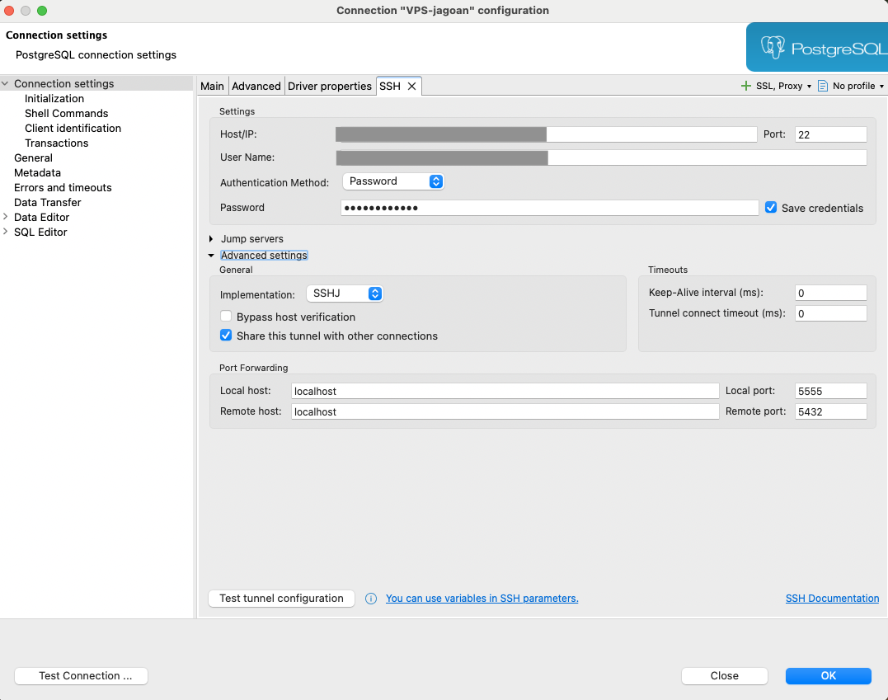

This is a Demo Project For BGN

## Getting Started

## CI/CD

[CI/CD Guide](./docs/cicd-github.md)

## database connection via ssh tunnel

```sh
ssh user@remotemachine -L 5555:localhost:5432
```

atau pake dbeaver 

### buat database untuk jagagizi

```sh
sudo -u postgres psql
```

```sql
CREATE DATABASE jagagizi_db;
CREATE USER jagagizi_user;
GRANT ALL PRIVILEGES ON DATABASE jagagizi_db TO jagagizi_user;
```

```psql
\password
```